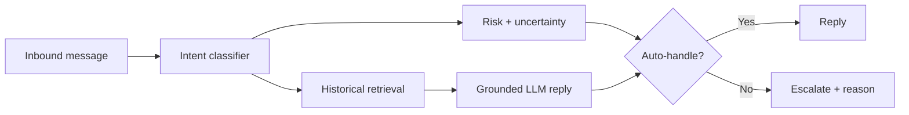

# <Project Name>

AI support agent for `<BRAND>` built for the Hiver SDE Intern take-home assignment.

## Headline result

> `<X>% acceptable auto-handled replies at <Y>% coverage on a locked human-labelled test set.`

Do not populate this sentence until the final evaluation artifact exists.

## What the system does

For each inbound customer message:
1. predicts a data-derived intent;
2. retrieves similar historical brand-support interactions;
3. drafts a grounded reply;
4. auto-handles or escalates with a reason.

## Quick reproduction - under 15 minutes

### Requirements
- Python 3.12
- `uv`

### Setup

```bash
git clone <repo>
cd <repo>
uv sync --frozen
```

### Reproduce headline results

```bash
uv run python -m hiver_agent.cli eval --fast
```

Expected outputs:
- metric summary printed to console;
- `artifacts/eval/metrics.json`;
- figures under `artifacts/figures/`.

The fast path uses frozen curated data and cached model outputs where necessary so the evaluator does not need the full ~3M tweet corpus.

### Optional: rerun LLM generation/judge

```bash
cp .env.example .env
# add provider key
uv run python -m hiver_agent.cli eval --fast --rerun-llm
```

## Full pipeline

```bash
# 1. Get source data
uv run python scripts/download_data.py

# 2. Profile brands
uv run python -m hiver_agent.cli profile-brands

# 3. Curate selected brand
uv run python -m hiver_agent.cli build-data

# 4. Train classifiers/index
uv run python -m hiver_agent.cli train

# 5. Evaluate
uv run python -m hiver_agent.cli eval
```

## Architecture



## Dataset

Primary source:
Kaggle - Customer Support on Twitter by Thought Vector.

Do not redistribute the full dataset without confirming the source license and requirements.

## Brand and intent taxonomy

Chosen brand: `<BRAND>`

Intent list:
- ...
- ...
- ...

See `docs/intent_taxonomy.md`.

## Golden evaluation set

- human-labelled examples:
- calibration:
- locked test:
- sampling method:
- freeze hash:

## Results

### Baselines vs final system

| System | Intent macro-F1 | Escalation recall | Risky false-auto | Coverage | Reply accept |
|---|---:|---:|---:|---:|---:|
| Trivial | | | | | |
| TF-IDF | | | | | |
| Final | | | | | |

## LLM judge validation

Describe:
- judge model;
- rubric;
- human sample size;
- agreement statistics;
- important judge-human disagreements.

## Failure analysis

Link to `docs/failure_analysis.md`.

## What is misleading about the headline number?

Summarize the caveats from the report.

## Reproducibility

List:
- random seed;
- embedding model;
- classifier version;
- prompt version;
- generation model;
- judge model;
- golden-set hash.

## Tests

```bash
uv run pytest -q
uv run ruff check .
```

## Repository map

Explain the important directories only.

## Citations / acknowledgements

Cite:
- source dataset;
- embedding model;
- any borrowed evaluation rubric/prompt;
- external code snippets or methods.

## Limitations

Be explicit.

## License

Add an appropriate repository license only after checking compatibility with source data and any included derived artifacts.
